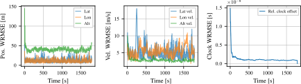

## Introduction

This page contains some auxiliary information on the paper 

> Sonnleitner, C., Hobiger, T. Wide-area multilateration airspace surveillance with unsynchronized low-cost ADS-B receivers using TDOA observations. *NAVIGATION*.

As quite a lot of figures have been produced that break the frame of the paper but still contain useful insights they are given here.

## Simulations

### Overview 

The simulations presented in the paper are:

<table class="tg">
<thead>
  <tr>
    <th colspan="2">Observation types</th>
    <th colspan="2">Ground stations</th>
    <th rowspan="2">TOA measurement uncertainty</th>
    <th rowspan="2">Clocks</th>
    <th rowspan="2">Identifier</th>
  </tr>
  <tr>
    <th>TDOA</th>
    <th>ADS-B pos</th>
    <th>#</th>
    <th>Placement</th>
  </tr>
</thead>
<tbody>
  <tr>
    <td class="tg-odd">✅</td>
    <td class="tg-odd"></td>
    <td class="tg-odd">42</td>
    <td class="tg-odd">Grid placed 120km</td>
    <td class="tg-odd">100ns</td>
    <td class="tg-odd">Perfect</td>
    <td class="tg-odd">T_G42-P</td>
  </tr>
  <tr>
    <td class="tg-even">✅</td>
    <td class="tg-even"></td>
    <td class="tg-even">42</td>
    <td class="tg-even">Grid placed 120km</td>
    <td class="tg-even">100ns</td>
    <td class="tg-even">SI532</td>
    <td class="tg-even">T_G42-S</td>
  </tr>
  <tr>
    <td class="tg-odd">✅</td>
    <td class="tg-odd"></td>
    <td class="tg-odd">56</td>
    <td class="tg-odd">Grid placed 100km</td>
    <td class="tg-odd">100ns</td>
    <td class="tg-odd">SI532</td>
    <td class="tg-odd">T_G56-S</td>
  </tr>
  <tr>
    <td class="tg-even">✅</td>
    <td class="tg-even"></td>
    <td class="tg-even">42</td>
    <td class="tg-even">Grid placed 120km</td>
    <td class="tg-even">1us</td>
    <td class="tg-even">SI532</td>
    <td class="tg-even">T_G42-S-1u</td>
  </tr>
  <tr>
    <td class="tg-odd">✅</td>
    <td class="tg-odd">✅</td>
    <td class="tg-odd">42</td>
    <td class="tg-odd">Grid placed 120km</td>
    <td class="tg-odd">100ns</td>
    <td class="tg-odd">SI532</td>
    <td class="tg-odd">TP_G42-S</td>
  </tr>
  <tr>
    <td class="tg-even">✅</td>
    <td class="tg-even"></td>
    <td class="tg-even">60</td>
    <td class="tg-even">Largest cities</td>
    <td class="tg-even">100ns</td>
    <td class="tg-even">Perfect</td>
    <td class="tg-even">T_C60-P</td>
  </tr>
  <tr>
    <td class="tg-odd">✅</td>
    <td class="tg-odd"></td>
    <td class="tg-odd">40</td>
    <td class="tg-odd">Largest cities</td>
    <td class="tg-odd">100ns</td>
    <td class="tg-odd">SI532</td>
    <td class="tg-odd">T_C40-S</td>
  </tr>
  <tr>
    <td class="tg-even">✅</td>
    <td class="tg-even"></td>
    <td class="tg-even">60</td>
    <td class="tg-even">Largest cities</td>
    <td class="tg-even">100ns</td>
    <td class="tg-even">SI532</td>
    <td class="tg-even">T_C60-S</td>
  </tr>
  <tr>
    <td class="tg-odd">✅</td>
    <td class="tg-odd">✅</td>
    <td class="tg-odd">40</td>
    <td class="tg-odd">Largest cities</td>
    <td class="tg-odd">100ns</td>
    <td class="tg-odd">SI532</td>
    <td class="tg-odd">TP_C40-S</td>
  </tr>
</tbody>
</table>

The identifiers are built up by the relevant parameters that differ between the simulations:

{:style="text-align:center;"}
{: width="250pt" }

### Individual plots

#### Ground stations placed in grid




  {:style="text-align:center;"}
  {: width="80%" }

  {: width="100%" }

  {: width="100%" }

  {:style="text-align:center;"}
  {: width="50%"}



  {:style="text-align:center;"}
  {: width="80%" }

  {: width="100%" }

  {: width="100%" }

  {:style="text-align:center;"}
  {: width="50%" }



  {:style="text-align:center;"}
  {: width="80%"}

  {: width="100%" }

  {: width="100%" }

  {:style="text-align:center;"}
  {: width="50%" }



  {:style="text-align:center;"}
  {: width="80%" }

  {: width="100%" }

  {: width="100%" }

  {:style="text-align:center;"}
  {: width="50%" }



  {:style="text-align:center;"}
  {: width="80%" }

  {: width="100%" }

  {: width="100%" }

  {:style="text-align:center;"}
  {: width="50%" }




#### Ground stations placed in cities




  {:style="text-align:center;"}
  {: width="80%" }

  {: width="100%" }

  {: width="100%" }

  {:style="text-align:center;"}
  {: width="50%" }



  {:style="text-align:center;"}
  {: width="80%" }

  {: width="100%" }

  {: width="100%" }

  {:style="text-align:center;"}
  {: width="50%" }



  {:style="text-align:center;"}
  {: width="80%" }

  {: width="100%" }

  {: width="100%" }

  {:style="text-align:center;"}
  {: width="50%" }



  {:style="text-align:center;"}
  {: width="80%" }

  {: width="100%" }

  {: width="100%" }

  {:style="text-align:center;"}
  {: width="50%" }


